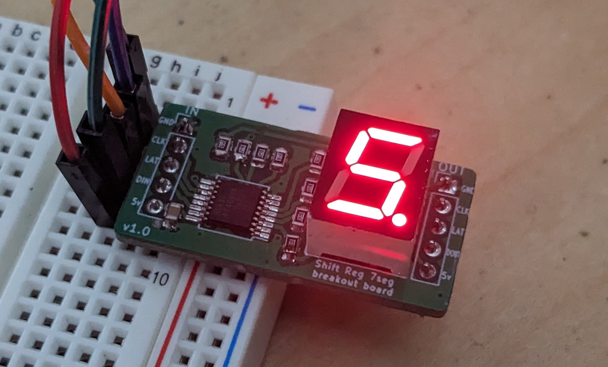

[](https://github.com/KenwoodFox/SegmentTestBoard/actions/workflows/hardware_workflow.yml)
[](https://github.com/KenwoodFox/SegmentTestBoard/actions/workflows/firmware_workflow.yml)


# SegmentTestBoard

The segment test board is a small board comprising the
[SN74HC595](https://www.lcsc.com/product-detail/Shifting-Register_Texas-Instruments-SN74HC595PWR_C273642.html) shift register,
and the [SM420391N](https://www.lcsc.com/product-detail/Led-Segment-Display_ARKLED-Wuxi-ARK-Tech-Elec-SM420391N-8_C252199.html) led seven segment display.



If you're looking for the latest docs/builds, see our [Releases Page](https://github.com/KenwoodFox/SegmentTestBoard/releases).

# Getting Started

First, clone this repo (and optionally checkout a branch)

```shell
git clone https://github.com/KenwoodFox/SegmentTestBoard.git
cd SegmentTestBoard
```

# Init Submodules

Some libraries and resources are included as submodules, run the following
command to initialize them before opening the main sch

(If you get a missing library error, make sure to do this)

```shell
git submodule update --init --recursive
```


## Project Layout

If you want to use this project template for yourself, you can find it [here!](https://github.com/KenwoodFox/Project-Template)


# License

License is BSD(2)
